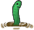
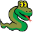
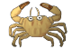

<h1 style="color:red;">The Evolution</h1>

<i>ein Projekt von Leif Peters und Linus Reck</i>

Das vorliegende Programm wurde mit Hilfe "<mark>Greenfoot's</mark>" geschrieben. Beim Bearbeiten orientierten wir uns an den Stride-Angaben und dem Greenfoot-Buch.

 Unser <a href="https://leynus.github.io/Stundenprotokoll/">Stundenprotokoll</a>
<h2>Inhaltsverzeichnis</h2>
<ul>
<li><a href="#anf">Anfänge</a></li>
<li><a href="#sdp">Sinn des Programms</a></li>
<li><a href="#ads">Ablauf des Spiels</a></li>
<li><a href="#adp">Ablauf der Programmierung</a></li>
<ul>
<li><a href="#era">Erste Actor</a></li>
<li><a href="#nah">Nahrungskette</a></li>
<li><a href="#zas">Zuschauer als Spieler</a></li>
<li><a href="#mus">Musik</a></li>
<li><a href="#for">Fortpflanzung</a></li>
<li><a href="#evh">Einführung von Hunger</a></li>
<li><a href="#sch">Die Schlange</a></li>
<li><a href="#zom">Zombiekrabben</a></li>
<li><a href="#gao">Game Over</a></li>
<li><a href="#sco">Der Score</a></li>
</ul>
<li><a href="#kla">Klassen</a></li>
<ul>
<li><a href="#cr1">crab.class</a></li>
<li><a href="#lob">lobster.class</a></li>
<li><a href="#sta">starfish.class</a></li>
<li><a href="#wor">worm.class</a></li>
<li><a href="#sna">snake.class</a></li>
<li><a href="#cr2">crab2.class</a></li>
<li><a href="#gam">gameover.class</a></li>
</ul>
<li><a href="#pfz">PLäne für die Zukunft</a></li>
</ul>
<h2 style="color:green;" id="anf">
Anfänge
</h2>

Unsere eigentliche Idee war es, mit einem RaspberryPi zu arbeiten. In den ersten Stunden probierten wir dies aus und installierten ein neues Betriebssystem auf einem dieser Computer. Da wir uns diese Arbeit allerdings anders vorgestellt hatten, hörten wir recht schnell mit diesem Projekt auf und ließen uns eine neue Idee einfallen. Unser Ziel war (und ist) es ein Doppelkopfspiel mit Greenfoot zu programmieren. Dafür müssten wir uns aber erstmal mit dem Programm und Programmierung allgemein auseinandersetzen. Wir begannen mit den Greenfoot-Stride Lernaktivitäten. Später haben wir auf Grundlage dieser, eigene Ideen in die Welt gebracht, woraus nach einer Zeit ein Spiel entstanden ist.

<h2 style="color:darkorchid;" id="sdp">
Sinn des Programms
</h2>

Dieses Programm dient der Einarbeitung in das Programm "Greenfoot", weswegen es sowohl Elemente eines Spiels der aktiven Steuerung eines "Actors", als auch Elemente eines sich selbst entwickelnden Programms (evolutionssimulierende Ansätze) enthält. So mag es einem Betrachter erscheinen, als könne man einige Befehlsketten anders ausdrücken.

<h2 style="color:royalblue;" id="ads">
Ablauf des Spiels
</h2>

In diesem Spiel steuert man mit den Pfeiltasten einen Wurm. Mit der rechten und linken Pfeiltaste dreht sich der Wurm, mit der oberen und unteren Taste bewegt sich der Wurm vorwärts und rückwärts. In der Spielwelt gibt es noch drei weitere Spielklassen, die vom Computer gesteuert werden. Die Krabben, die Hummer und die Seesterne sind die anderen Klassen in diesem Spiel. Sie fressen sich gegenseitig und vermehren sich, wenn sie jemanden gefressen haben. Wenn sie zu lange nichts fressen, verhungern sie. Der Wurm hat die Fähigkeit, jedes andere Tier zu fressen und kann von keinem anderen Tier getötet werden. Er verhungert aber auch, wenn er zu lange nichts gegessen hat. Wenn der Wurm eine Krabbe frisst, erscheint diese nach einer Zeit als Zombiekrabbe am Todesort wieder. Zombiekrabben sind doppelt so schnell, wie normale Krabben und stecken diese bei Berührung an. Treffen sie auf Hummer oder Seesterne, sterben beide Tiere. Ziel des Spiels ist es, so lange wie möglich mit dem Wurm zu überleben.

<h2 style="color:indianred;" id="adp">
Ablauf der Programmierung
</h2>
<h3 style="color:darkturquoise;" id="era">
Erste Actor
</h3>

Als Grundlage verwenden wir die "Crab-World" Vorlage. Wir haben damit angefangen, dass wir eine einfache <a href="#cr1">crab.class</a> in die World eingefügt haben. Durch den Befehl "move (5)" bewegt sich diese <a href="#cr1">crab.class</a> geradeaus. Da die World begrenzt ist, veränderten wir die Bewegungsrichtung beim Auftreffen auf die Wand (Äußeres Ende der Welt). Die Richtung sollte nicht konkret vorgegeben sein, sondern immer zufällig sein. Mit dem Befehl <mark>"if (isAtEdge()) { turn(Greenfoot.getRandomNumber(90) - 45); }"</mark> konnten wir dies umsetzen. Wir haben mehrere Objekte der <a href="#cr1">crab.class</a> in die World hinzugefügt. Außerdem haben wir die <a href="#sta">starfish.class</a> und die <a href="#lob">lobster.class</a> mit gleichen Eigenschaften wie die <a href="#cr1">crab.class</a> eingefügt.

<h3 style="color:darkturquoise;" id="nah">
Nahrungskette
</h3>

Unser vorläufiges Ziel war es nun, eine Art Evolutionssimulation zu erstellen. Die drei verschiedenen Klassen sollten je eine Klasse haben, die sie fressen (aus der Welt entfernen) und von einer Klasse gefressen werden (aus der Welt entfernt werden). Wenn die <a href="#cr1">crab.class</a> die <a href="#sta">starfish.class</a> berührt, entfernt sie diese aus der World.

<h3 style="color:darkturquoise;" id="zas">
Zuschauer als Spieler
</h3>

Als nächstes haben wir eine <a href="#wor">worm.class</a> in das Spiel eingefügt, welche vom Spieler gesteuert werden soll. Mit Befehlen, wie zum Beispiel <mark>"{ if (Greenfoot.isKeyDown("left")) { turn(-4); }"</mark> haben wir die Pfeiltasten belegt. Die obere und untere lässt die <a href="#wor">worm.class</a> sich vorwärts und rückwärts bewegen. Die rechte und linke Teste lässt den Actor sich nach rechts oder links drehen. Die <a href="#wor">worm.class</a> bekam die Eigenschaft, alle anderen Classes (mit Ausnahme der <a href="#sna">snake.class</a> und der <a href="#gam">gameover.class</a>) aus der World zu entfernen (Der Wurm soll die anderen Tiere fressen). Um das ganze Spiel etwas zufälliger zu machen, stellten wir in der World ein, dass jedes Objekt an einer zufälligen Stelle in der World erscheint.

<h3 style="color:darkturquoise;" id="mus">
Musik
</h3>

Wir haben Töne eingefügt, die immer dann erklingen, wenn zwei "Actor" gleicher Klasse aufeinander trafen. Da wir dies allerdings als relativ störend auf Dauer empfanden, haben wir diesen Programmabschnitt wieder entfernt.

<h3 style="color:darkturquoise;" id="for">
Fortpflanzung
</h3>

Neue Objekte zu erzeugen stand weiterhin im Fokus unserer Anstrengungen. Wir versuchten eine Art Fortpflanzung einzuführen, indem wir immer ein neues Objekt in die World einfügten, wenn zwei gleiche Objekte aufeinandertrafen. Dies führte allerdings zu einem unkontrollierten, exponentiellen Wachstum (auch Crab-Bomb genannt). Wir haben dieses Problem gelöst, indem wir immer ein neues Objekt eingeführt haben, wenn ein Objekt ein anderes frisst (mit Ausnahme von der <a href="#wor">worm.class</a>). Dazu gaben wir den Befehl an die World, dass immer wenn ein Objekt ein anderes entfernt, ein neuer Objekt mit der gleichen Klasse wie die des Entfernenden einzufügen. Dies haben wir mit folgendem Programmabschnitt gemacht: <mark>if (isTouching(starfish.class)) { World myworld; myworld = getWorld(); myworld.addObject( new Crab(), Greenfoot.getRandomNumber(600), Greenfoot.getRandomNumber(400)); removeTouching(starfish.class);</mark>

<h3 style="color:darkturquoise;" id="evh">
Einführung von Hunger
</h3>

Mit der Einführung von Variablen eröffneten sich uns neue Möglichkeiten um Zähler einzubauen. Wir konnten jetzt den Faktor Zeit in unser Spiel einbauen. Wir haben einen Hungerwert eingeführt, der ein Objekt aus der World entfernt, wenn es zu lang kein anderes Objekt mehr gefressen (aus der World entfernt) hat. Dazu stellten wir für jedes Objekt einen Zähler (eine Variable, die mit jeder Schleife +1 hochzählt) ein, der zurückgesetzt wird, wenn es ein anderes Objekt aus der World entfernt. Wenn dieser Zähler einen bestimmten Wert erreicht, gibt das Objekt der World den Befehl, dieses Objekt zu entfernen. <mark>private int TageSeitMahlzeit TageSeitMahlzeit = TageSeitMahlzeit + 1 if (TageSeitMahlzeit == 300) { getWorld().removeObject(this); } if (isTouching(starfish.class)) { removeTouching(starfish.class); TageSeitMahlzeit = 0; }</mark>

<h3 style="color:darkturquoise;" id="sch">
Die Schlange
</h3>

Um unser Programm mehr mit einem Spiel und der damit verbundenen Leistung in Verbindung zu bringen, haben wir eine Verlust-Simulation eingeführt. Ein Objekt der <a href="#sna">snake.class</a> erscheint, bewegt sich parallel zur X-Achse auf die <a href="#wor">worm.class</a> zu und entfernt den Actor, wenn dieser einige Zeit lang keine Objekte mehr entfernt hat (Wenn der Wurm zu lange nichts gefressen hat, wird er von der Schlange gefressen. Um dies zu erreichen, haben wir der <a href="#wor">worm.class</a> befohlen, dass sie sich nur bewegen kann, wenn ihre Hungervariable (<mark>"tageSeitMahlzeit"</mark>) unter dem Wert 300 liegt. Wenn dieser Wert erreicht ist, kann sie sich nur noch drehen und sie gibt ein Signal an die World, welche daraufhin eine <a href="#sna">snake.class</a> auf die Position X=0 und der selben Position Y, wie die der <a href="#wor">worm.class</a> eingeführt. Diese haben wir durch eine Variable bestimmt, welche die Y-Koordinate beim Erreichen des Hungerlevels (tageSeitMahlzeit=300) misst. <mark>private int tageSeitMahlzeit; private int Todesort if (Greenfoot.isKeyDown("up") && tageSeitMahlzeit größer 300) { move(5); } if (tageSeitMahlzeit == 300) { Todesort = getY(); getWorld().addObject( new Snake(), 0, Todesort); } } }</mark> Die <a href="#sna">snake.class</a> bewegt sich parallel zur X-Achse auf die <a href="#wor">worm.class</a> zu, entfernt diese und bewegt sich in der gleichen Richtung zurück, in der sie hergekommen ist. 

<h3 style="color:darkturquoise;" id="zom">
Zombiekrabben
</h3>

In einer weiteren Programmergänzung behandelten wir das Problem, was mit toten Objekten passiert. Als weitere Spielherausforderung erschufen wir "Zombiekrabben". Crab-Objekte die von der <a href="#wor">worm.class</a> gefressen wurden sollten nach einer gewissen Zeit "wiederauferstehen". Dies haben wir mit dem Zusammenspiel von mehreren Variablen und if-Schleifen gemacht. Wenn die <a href="#wor">worm.class</a> eine <a href="#cr1">crab.class</a> aus der World entfernt, wird durch zwei Variablen (<mark>"TodesortCrabX"</mark> und <mark>"TodesortCrabY"</mark>) festgehalten. Außerdem wird die Variable <mark>"Zombiecrab"</mark> um 1 erhöht. Wenn diese Variable größer als 0 ist, beginnt eine zweite Variable (<mark>"ToteCrab"</mark>) hochzuzählen. Wenn diese bei dem Wert 200 angelangt ist, wird der World ein Befehl gegeben, eine <a href="#cr2">crab2.class</a> an dem vorher bestimmten Todesort einzufügen. Die Variable "Zombiecrab" wird um 1 subtrahiert und "ToteCrab" wird auf 0 zurückgesetzt. <mark>private int Zombiecrab; private int TodesortCrabX; private int TodesortCrabY; private int ToteCrab removeTouching(Crab.class); Zombiecrab = Zombiecrab + 1; TodesortCrabX = getX(); TodesortCrabY = getY(); } if (Zombiecrab > 0) { ToteCrab = ToteCrab + 1; } if (ToteCrab == 200) { getWorld().addObject( new Crab2(), TodesortCrabX, TodesortCrabY); Zombiecrab = Zombiecrab - 1; ToteCrab = 0; }</mark> Gäbe es nur ein Objekt der <a href="#cr1">crab.class</a>, hätte man auch mit einer booleanschen Variable arbeiten könne (True, wenn die <a href="#wor">worm.class</a> die <a href="#cr1">crab.class</a> berührt hätte). Da es aber mehrere Actor der <a href="#cr1">crab.class</a> gibt, haben wir dieses Problem wie oben beschrieben gelöst. <a href="#cr2">Die crab2.class</a> ist doppelt so schnell, wie die <a href="#cr1">crab.class</a>. Wenn die <a href="#cr2">crab2.class</a> auf die <a href="#lob">lobster.class</a> oder die <a href="#sta">starfish.class</a> trifft, werden beide Objekte aus der World entfernt.

<h3 style="color:darkturquoise;" id="gao">
Game Over
</h3>

Zum Schluss haben wir ein "Game Over" Schriftzug in der World entstehen lassen. Die Grafik dazu haben wir selbst erstellt. Diese <a href="#gam">gameover.class</a> tritt in der Mitte des Spielfeldes auf, wenn die Schlange das linke Ende der Karte erreicht hab.

<h3 style="color:darkturquoise;" id="sco">
Der Score
</h3>

Um unser Programm mehr einem Spiel anzunähern, haben wir einen Score eingefügt. Dieser zählt die von der <a href="#wor">worm.class</a> entfernten Actor (Anzahl der Tiere, die der Wurm gefressen hat). Außerdem haben wir einen Zähler eingefügt, der mit jedem Durchlauf einen nach oben zählt. 
 Der Zähler „score“ zählt, die Durchläufe wie folgt: 
<mark>public static int score 
score = score + 1 
getWorld().showText („Your Score:“ + score, 100, 30)</mark> 
Der Wert des Zählers wird an der Stelle (100 / 30) hinter „Your Score:“ gezeigt.
Wenn die <a href="#sna">snake.class</a> den Actor aus der World entfernt, hört der Zähler auf hochzuzählen. 
Der Zähler “eaten“ wird immer aktiviert, wenn eine if-Schleife durch das Berühren der <a href="#wor">worm.class</a> mit einem anderen Actor geöffnet wird. Sein Wert erscheint am Punkt (150 / 50) hinter „Number of eaten animals“. 
Er lautet wie folgt: 
<mark>public static int eaten 
if(isTouching(crab.class)) eaten = eaten + 1 
getWorld().showText („Number of eaten animals:“ + eaten, 150, 50)</mark> 

Damit wir mit verschiedenen Klassen Zugriff auf die Variablen haben, sind diese auf public gesetzt. So konnten wir der <a href="#gam">gameover.class</a> der World den Befehl geben, mit diesen Werten zu arbeiten.
Um eine taktische Idee notwendig zu machen beim Spielen dieses Spiels haben wir diese beiden „Scores“ multipliziert zu einem Gesamtscore, der am Ende durch folgenden Code angezeigt wird: 
<mark>getWorld().showText („Final Score“ + Worm.eaten * Worm.score, 300, 250)</mark>
Anregungen zu dieser Einführung gab uns folgendes <a href="https://youtu.be/ubsC4PR2WjI">Video</a> von dem Erfinder Greenfoot's.

<h2 id="kla" style="color:midnightblue;">Klassen</h2>
<h3 style="color:orchid;" id="cr1">crab.class</h3>

Der Actor bewegt sich fünf Längeneinheiten pro Schleife vorwärts. 
Mit jeder Schleife zählt die Variable "TageSeitMahlzeit" einen hoch. 
Wenn das Objekt an den Rand der World trifft, dreht es sich mit einem zufälligen Winkel zwischen 45 und 90°. 
Trifft eine <a href="#cr1">crab.class</a> auf einen Actor der <a href="#sta">starfish.class</a>, wird der World befiehlt, einen neues Objekt der <a href="#cr1">crab.class</a> an einer zufälligen Stelle zu erzeugen. Außerdem wird dieser Actor der <a href="#sta">starfish.class</a> aus der World entfernt. Die Variable "TageSeitMahlzeit" wird zurück auf 0 gesetzt. 
Wenn die Variable "TageSeitMahlzeit" den Wert 300 erreicht, wird der World der Befehl gegeben, diesen Actor zu entfernen.

<h3  style="color:orchid;" id="lob">lobster.class</h3>

Wenn der Actor auf eine <a href="#cr2">crab2.class</a> trifft, wird diese entfernt. Außerdem wird der World mitgeteilt dieses Objekt der <a href="#lob">lobster.class</a> zu entfernen. 
Der restliche Quelltext ähnelt dem der <a href="#cr1">crab.class</a> stark.

<h3 style="color:orchid;" id="sta">starfish.class</h3>

Siehe <a href="#cr1">crab.class</a>, <a href="#lob">lobster.class</a>

<h3 style="color:orchid;" id="wor">worm.class</h3>

Wird die linke oder rechte Pfeiltaste gedrückt, dreht der Actor sich in die dementsprechende Richtung. 
Pro Schleife zählt die Variable "TageSeitMahlzeit" einen hoch. 
Wenn die Pfeiltaste nach oben bzw. nach unten gedrückt wird und der Wert der Variable "TageSeitMahlzeit" unter 300 liegt, bewegt sich das Objekt nach vorne bzw. nach hinten. 

Wenn der Actor ein Objekt der <a href="#sta">starfish.class</a>, <a href="#lob">lobster.class</a>, <a href="#cr2">crab2.class</a> wird die Variable "TageSeitMahlzeit" gleich Null gesetzt, das Objekt wird entfernt und die Variable "eaten" zählt einen nach oben. Wenn es sich um eine <a href="#cr1">crab.class</a> handelt, werden zusätzlich noch durch die Variablen "TodesortCrabX" und "TodesortCrabY" die aktuellen Koordinaten bestimmt und zu der Variable "Zombiecrab" wird 1 addiert. 
Der World wird befehligt, den Wert der Variable "eaten" hinter "Number of eaten animals" am Punkt (150 / 50) 
Ist die Variable "Zombiecrab" größer als Null, beginnt die Variable "ToteCrab" mit jeder Schleife +1 hochzuzählen. 
Ist diese bei 200 angelangt, gibt sie der World den Befehl einen neuen Actor der <a href="#cr2">crab2.class</a> auf den Punkt mit den durch "TodesortCrabX" und "TodesortCrabY" Koordinaten einzufügen. Die Variable "Zombiecrab" wird mit 1 subtrahiert und die Variable "ToteCrab" wird gleich Null gesetzt. 
Ist der Wert der Variable "tageSeitMahlzeit" bei 300 angelangt, wird der Y-Wert des Actors mit der Variable "Todesort" bestimmt. Dieser kann sich nur noch drehen. Der World wird befiehlt, einen Actor der <a href="#sna">snake.class</a> an den Punkt (0 / "Todesort"). 
Die Variable "score" zählt mit jeder Schleife +1. Die World zeigt ihren Wert hinter "Your Score:" am Punkt (100 / 30).

<h3 style="color:orchid;" id="sna">snake.class</h3>

Der Actor bewegt sich in X-Richtung, entfernt bei Berührung den Actor der <a href="#wor">worm.class</a>, dreht sich um 180° bewegt sich vorwärts zurück an den Rand der World. 
Ist der Actor am Rand angelangt, wird der World befehligt, ein Objekt der <a href="#gam">gameover.class</a> am Punkt (300 / 200) einzufügen.

<h3 style="color:orchid;" id="cr2">crab2.class</h3>

 Siehe <a href="#cr2">crab.class</a>

<h3 style="color:orchid;" id="gam">gameover.class</h3>

Die Variablen "eaten" und "score" der <a href="#wor">worm.class</a> werden miteinander multipliziert und bei (300 / 250) als "Final Score:" angegeben.

<h2 style="color:lime;" id="pfz">
Pläne für die Zukunft
</h2>

In Zukunft stellen wir uns vor, unsere Kenntnisse aus Greenfoot und der html-Gestaltung zu Nutzen, um ein größeres und anspruchsvolleres Projekt in Angriff zu nehmen.

